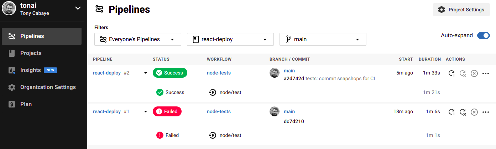

# Building

[](https://circleci.com/gh/tonai/react-deploy)

## Generate bundle

Run command:

```bash
npm run build
```

## Test bundle

```bash
npm i -g serve
```

Run command:

```bash
serve -s build
```

But we have a problem with fetching the API (because we don't have the proxy anymore).

Create file `.env.development` with:

```
REACT_APP_API_URL = ''
```

Create file `.env.production` with:

```
REACT_APP_API_URL = 'http://localhost:3001'
```

Create file `.env.test` with:

```
REACT_APP_API_URL = ''
```

Create file `src/services/apiService/apiService.js` with:

```js
export const baseUrl = (() => {
  const url = process.env.REACT_APP_API_URL;
  if (url.lastIndexOf('/') === url.length - 1) {
    return url.slice(0, -1);
  }
  return url;
})();

export default function api(url, options) {
  if (url.indexOf('/') === 0) {
    url = url.slice(1);
  }
  return fetch(`${baseUrl}/${url}`, options);
}
```

Replace `fetch` calls with this new `api` function and try again.

## Analysing bundle

```bash
npm i -D source-map-explorer
```

Update file `package.json` with:

```json
"scripts": {
  "analyze": "source-map-explorer 'build/static/js/*.js'"
},
```

Run command:

```bash
npm run analyze
```

# Deploy

## GH pages

```
npm i -D gh-pages
```

Update file `package.json` with:

```json
"scripts": {
  "predeploy": "npm run build",
  "deploy": "gh-pages -d build"
},
```

Run command:

```bash
npm run deploy
```

Check the settings of your project in Github and search for `GitHub Pages` to get the URL your app (exemple: https://tonai.github.io/react-deploy/).

Check your site, but files should not load correclty.

Update file `package.json` with:

```json
"homepage": "https://tonai.github.io/react-deploy/"
```

Run command again:

```bash
npm run deploy
```

And check again.

## AWS Amplify

### Initialization

https://docs.amplify.aws/start/getting-started/installation/q/integration/react

```bash
npm i -g @aws-amplify/cli
```

Run command:

```bash
amplify configure
```

Steps :

- Select region: `eu-west-1`
- User name: `amplify-react-deploy`
- Create user on web interface:
  - Click `Suivant: Autorisations`
  - Click `Suivant: Balises`
  - Click `Suivant: Vérification`
  - Click `Créer un rôle`
- Enter access key
- Enter secret key
- Profile name: `react-deploy`

### Setup backend

Run command:

```bash
amplify init
```

Steps :

- Project name: `reactdeploy`
- Environment: `dev`
- Default editor: `Visual Studio Code`
- App type: `javascript`
- Javascript framework: `react`
- Source path: `src`
- Distribution path: `build`
- Build command: `npm run-script build`
- Start command: `npm run-script start`
- use AWS profile: `y`
- Profile: `react-deploy`

### Create API

Run command:

```bash
amplify add api
```

Steps:

- Service: `REST`
- Resource name: `apireactdeploy`
- Path: `/articles`
- Lambda source: `Create a new Lambda function`
- Resource name: `apiarticles`
- Lambda name: `articles`
- Runtime: `NodeJS`
- Template: `CRUD function for DynamoDB`
- DynamoDB source option: `Create a new DynamoDB table`
- DynamoDB:
  - Resource name: `dynamoarticles`
  - Table name: `articles`
  - Columns:
    - Column: `id`
    - Type: `number`
    - Add another column: `y`
    - Column: `title`
    - Type: `string`
    - Add another column: `y`
    - Column: `content`
    - Type: `string`
    - Add another column: `y`
    - Column: `category`
    - Type: `number`
    - Add another column: `y`
    - Column: `published`
    - Type: `boolean`
    - Add another column: `n`
  - Partition key: `id`
  - Sort key: `n`
  - Global secondary indexed: `n`
  - Lambda trigger: `n`
- Create another resources: `y`
- Category: `storage`
- Select operations: `create`, `read`, `update`, `delete`
- Recurring schedule: `n`
- Lambda layers: `n`
- Edit now: `n`
- Restrict API access: `n`
- Add another path: `y`
- Path: `/categories`
- Lambda source: `Create a new Lambda function`
- Resource name: `apicategories`
- Lambda name: `categories`
- Runtime: `NodeJS`
- Template: `CRUD function for DynamoDB`
- DynamoDB source option: `Create a new DynamoDB table`
- DynamoDB:
  - Resource name: `dynamocategories`
  - Table name: `categories`
  - Columns:
    - Column: `id`
    - Type: `number`
    - Add another column: `y`
    - Column: `title`
    - Type: `string`
    - Add another column: `n`
  - Partition key: `id`
  - Sort key: `n`
  - Global secondary indexed: `n`
  - Lambda trigger: `n`
- Create another resources: `y`
- Category: `storage`
- Resource: `dynamocategories`
- Select operations: `read`
- Recurring schedule: `n`
- Lambda layers: `n`
- Edit now: `n`
- Restrict API access: `n`
- Add another path: `n`

### Deploy API

Run command:

```bash
amplify push
```

It will upload files and create a backend endpoint (exemple: `https://x15ez5s0bl.execute-api.eu-west-1.amazonaws.com/dev`)

Service will be created, you can check the status with:

```bash
amplify console
```

### Add categories in database

Steps:

- Connect to AWS console
- Search for `DynamoDB`
- Click `Tables` in the left pane
- Select table `categories-dev`
- In the right pane click `Éléments`
- Click `Créer un élément`
  - Create element `{ "id": 1, "title": "News" }`
  - Create element `{ "id": 2, "title": "Blog post" }`

### Update lambda functions

Update file `amplify/backend/function/apiarticles/src/app.js` with the content this [file](./amplify/backend/function/apiarticles/src/app.js).

Update file `amplify/backend/function/apicategories/src/app.js` with the content this [file](./amplify/backend/function/apicategories/src/app.js).

Deploy again with:

```bash
amplify push
```

Methods `POST`, `PUT` and `DELETE` need rework.

### Update frontend

Install frontend dependencies:

```bash
npm i aws-amplify @aws-amplify/ui-react
```

Create file `src/amplify.js`:

```js
import Amplify from 'aws-amplify';
import awsExports from './aws-exports';
Amplify.configure(awsExports);
```

Update file `src/index.js` with :

```js
import './amplify';
```

Update file `src/services/apiService/apiService.js` with:

```js
import { API } from 'aws-amplify';

const apiName = process.env.REACT_APP_API_NAME;

export default function api(url, options = {}) {
  if (url.indexOf('/') !== 0) {
    url = '/' + url;
  }

  const { method, ...init } = options;
  switch (method) {
    case 'DELETE':
      return API.delete(apiName, url, init);

    case 'POST':
      return API.post(apiName, url, init);

    case 'PUT':
      return API.put(apiName, url, init);

    default:
      return API.get(apiName, url, init);
  }
}
```

Update `addArticle` and `updateArticle` methods in file `src/services/articleService/articleService.js` with:

```js
addArticle(article) {
  return api('/articles', {
    article = { ...article, id: Date.now() }; // DynamoDB does not have auto increments
    body: article, // JSON.stringify is not needed anymore
    headers: { 'Content-Type': 'application/json' },
    method: 'POST'
  }).then(() => article); // Return created article
}

updateArticle(article) {
  return api(`/articles/${article.id}`, {
    body: article, // JSON.stringify is not needed anymore
    headers: { 'Content-Type': 'application/json' },
    method: 'PUT'
  });
}
```

Update all `.env*` files with:

```
REACT_APP_API_NAME = 'apireactdeploy'
```

### Deploy Frontend

Run command:

```bash
amplify add hosting
```

Steps:

- Plugin: `Amazon CloudFront and S3`
- Environment setup: `DEV`
- Bucket name: `react-deploy`
- Index: `index.html`
- Error: `index.html`

```bash
amplify publish
```

It will upload files and create a frontend endpoint (exemple: `http://react-deploy-dev.s3-website-eu-west-1.amazonaws.com/`)

Update file `package.json` with:

```json
"homepage": "http://react-deploy-dev.s3-website-eu-west-1.amazonaws.com/"
```

Run command again:

```bash
amplify publish
```

And check again.

### Fix E2E and UI tests

Update mocks files with the following [files](./cypress/fixtures).

Update file `cypress/integration/e2e.js` with:

```js
const getCategoriesRoute = '/dev/categories';
const getArticlesRoute = '/dev/articles';
const addArticleRoute = '/dev/articles';
const getArticleRoute = '/dev/articles/';
const editArticleRoute = '/dev/articles/';
const deleteArticleRoute = '/dev/articles/';

describe('E2E', () => {
  it('Visits the app', () => {
    cy.server();
    cy.route(getCategoriesRoute, 'fixture:getCategories.json').as('getCategories');
    cy.route(getArticlesRoute, 'fixture:getArticles.json').as('getArticles');

    cy.visit('/');
    cy.get('.Title__title').should('contain', 'Articles');
    cy.get('.Article').should('have.length', 3);
  });

  it('Filters articles', () => {
    cy.server();
    cy.route(getCategoriesRoute, 'fixture:getCategories.json').as('getCategories');
    cy.route(getArticlesRoute, 'fixture:getArticles.json').as('getArticles');

    cy.visit('/');
    cy.get('.Article').should('have.length', 3);
    cy.get('[name=title]').type('1');
    cy.get('.Article').should('have.length', 1);
    cy.get('[name=title]').clear();
    cy.get('[name=category]').select('1');
    cy.get('.Article').should('have.length', 2);
    cy.get('[name=category]').select('');
    cy.get('[name=published][value=draft]').check();
    cy.get('.Article').should('have.length', 1);
  });

  it('Go to add page', () => {
    cy.server();
    cy.route(getCategoriesRoute, 'fixture:getCategories.json').as('getCategories');
    cy.route(getArticlesRoute, 'fixture:getArticles.json').as('getArticles');

    cy.visit('/');
    cy.get('.Title__button').click();
    cy.location('pathname').should('eq', '/article');
    cy.get('.Title__title').should('contain', 'Add new article');
  });

  it('Add article', () => {
    cy.server();
    cy.route(getCategoriesRoute, 'fixture:getCategories.json').as('getCategories');
    cy.route(getArticlesRoute, 'fixture:getArticles.json').as('getArticles');
    cy.route('POST', addArticleRoute, 'fixture:addArticle.json').as('addArticle');

    cy.visit('/article');
    cy.get('[name=title]').type('Article 4');
    cy.get('[name=category]').select('2');
    cy.get('[name=content]').type('This is a test.');
    cy.get('[name=published]').check();
    cy.get('.ArticleForm__button').click();
    cy.get('.Title__title')
      .invoke('text')
      .then((title) => {
        const id = title.match(/\((.*)\)/)[1];
        cy.location('pathname').should('eq', '/article/' + id);
        cy.get('.Title__button').click();
        cy.location('pathname').should('eq', '/');
      });
  });

  it('Go to edit page', () => {
    const id = 3;

    cy.server();
    cy.route(getCategoriesRoute, 'fixture:getCategories.json').as('getCategories');
    cy.route(getArticlesRoute, 'fixture:getArticles.json').as('getArticles');
    cy.route(getArticleRoute + id, 'fixture:getArticle.json').as('getArticle');

    cy.visit('/');
    cy.get('.Article')
      .eq(id - 1)
      .find('.Article__link')
      .eq(0)
      .click();
    cy.location('pathname').should('eq', '/article/' + id);
    cy.get('.Title__title').should('contain', `Edit article (${id})`);
    cy.get('[name=content]').should('contain', 'Phasellus sit amet bibendum augue.');
  });

  it('Edit article', () => {
    const id = 3;

    cy.server();
    cy.route(getCategoriesRoute, 'fixture:getCategories.json').as('getCategories');
    cy.route(getArticlesRoute, 'fixture:getArticles.json').as('getArticles');
    cy.route(getArticleRoute + id, 'fixture:getArticle.json').as('getArticle');
    cy.route('PUT', editArticleRoute + id, 'fixture:editArticle.json').as('editArticle');

    cy.visit('/article/' + id);
    cy.get('[name=category]').select('1');
    cy.get('.ArticleForm__button').click();
    cy.get('.Title__button').click();
    cy.location('pathname').should('eq', '/');
  });

  it('Remove article', () => {
    const id = 3;

    cy.server();
    cy.route(getCategoriesRoute, 'fixture:getCategories.json').as('getCategories');
    cy.route(getArticlesRoute, 'fixture:getArticles.json').as('getArticles');
    cy.route('DELETE', deleteArticleRoute + id, 'fixture:deleteArticle.json').as('deleteArticle');

    cy.visit('/');
    cy.get('.Article')
      .eq(id - 1)
      .find('.Article__link')
      .eq(1)
      .click();
    cy.get('.Article').should('have.length', 2);
  });
});
```

Update file `cypress/integration/ui.js` with:

```js
const getCategoriesRoute = '/dev/categories';
const getArticlesRoute = '/dev/articles';
const getArticleRoute = '/dev/articles/';

describe('UI', () => {
  it('Homepage', () => {
    cy.server();
    cy.route(getCategoriesRoute, 'fixture:getCategories.json').as('getCategories');
    cy.route(getArticlesRoute, 'fixture:getArticles.json').as('getArticles');

    cy.visit('/');
    cy.document().toMatchImageSnapshot({
      imageConfig: {
        threshold: 0.001,
        thresholdType: 'percent'
      }
    });
  });

  it('Add page', () => {
    cy.server();
    cy.route(getCategoriesRoute, 'fixture:getCategories.json').as('getCategories');
    cy.route(getArticlesRoute, 'fixture:getArticles.json').as('getArticles');

    cy.visit('/article');
    cy.document().toMatchImageSnapshot();
  });

  it('Edit page', () => {
    const id = 1;

    cy.server();
    cy.route(getCategoriesRoute, 'fixture:getCategories.json').as('getCategories');
    cy.route(getArticlesRoute, 'fixture:getArticles.json').as('getArticles');
    cy.route(getArticleRoute + id, 'fixture:getArticle.json').as('getArticle');

    cy.visit('/article/1');
    cy.document().toMatchImageSnapshot();
  });
});
```

For better UI stability remove the automatic input focus in file `src/components/Filters/Filters.jsx`.

Also screenshots must be done on exactly the same environment as the CI to match each other (CircleCI run on Debian 10 as of october the 12 th 2020).

If it is too complicated, you can just comment all tests on file `ui.js`.

Test locally with `npm run test`.

Then push and check Circle CI.

# Continuous Integration / Delivery

## Circle CI

### Configuration

Steps

- Connect to https://app.circleci.com/ with your Github account
- Choose repo and click `Set Up Project`
- Click `Add Config`
  - if it does not work, choose `Manual Setup`
  - Create file `.circleci/config.yml` with:
  ```yml
  version: 2.1
  orbs:
    node: circleci/node@3.0.0
  workflows:
    node-tests:
      jobs:
        - node/test
  ```
  - Commit and push to Gihub
  - Back to Circle CI Click `Start Building`
- Click `Proceed to New UX`

Snapshots must be commited along your code so check the `.gitignore` file ad remove `__snapshots__` if it is present.

Anytime you push to Github, Circle CI will run all your tests.  
You will receive an email if tests failed.  
You cans see the status of your tests in Circle CI Pipelines page : https://app.circleci.com/pipelines/github/tonai/react-deploy



### Badge

https://circleci.com/docs/2.0/status-badges/

You can add in your README file a badge indicating the status of your last pipeline.

Update file `README.md` the with :

```markdown
[](LINK)
```

### Run cypress on CI

https://docs.cypress.io/guides/guides/continuous-integration.html#CircleCI

We must configure the usage if the dedicated Orb in Circle CI: https://github.com/cypress-io/circleci-orb

Steps:

- Go to Circle CI project pipelines
- Click `Organization Settings`
- Click `Security`
- Allow Uncertified Orbs: `Yes`

Update file `.circleci/config.yml` with:

```yml
version: 2.1
orbs:
  cypress: cypress-io/cypress@1.26.0
  node: circleci/node@3.0.0
workflows:
  build:
    jobs:
      - node/test
      - cypress/run:
          record: true
          start: 'npm start'
          wait-on: 'http://localhost:3000'
```

Maybe you have to downgrade the version of `react-scripts` to 3.4.0 (and `babel-loader` to 8.0.6) (see https://github.com/facebook/create-react-app/issues/8688).

```json
"dependencies": {
  "react-scripts": "3.4.0"
},
"devDependencies": {
  "babel-loader": "8.0.6"
},
```

Snapshots must be commited along your code so check the `.gitignore` file ad remove `__image_snapshots__` if it is present.

Also remove `aws-exports.js` from `.gitignore` file to be able to launch development server on CI.

Then push your code.

### Cypress dashboard

Run command:

```bash
npm run cypress:open
```

Steps:

- Click on tabs `Runs`
- Click `Setup Project to Record`
- Click `Setup Project`

Run command:

```bash
npx cypress run --record --key *****
```

Steps:

- Go to Circle CI project pipelines
- Click `Project Settings`
- Click `Environment Variables`
- Click `Add Environment Variable`
  - Name: `CYPRESS_RECORD_KEY`
  - Value: `*****`

## AWS Amplify

https://docs.amplify.aws/start/getting-started/hosting/q/integration/react#add-hosting-to-your-app
https://docs.cypress.io/guides/guides/continuous-integration.html#AWS-Amplify

To avoid ui tests to fail because of the test envionment comment all tests on file `ui.js`.

Run command:

```bash
amplify add hosting
```

Steps:

- Plugin: `Hosting with Amplify Console`
- Type: `Continuous deployment`
- Connect app using the web interface:
  - Connect a frontend web app: `Github`
  - Click `Connect branch`
  - Click `Authorize aws-amplify-console`
  - Confirm Github password
  - Référentiel: `tonai/react-deploy`
  - Branche: `main`
  - Click `Suivant`
  - Select a backend environment: `dev`
  - Click `Create new role`:
    - Click `Suivant: Autorisations`
    - Click `Suivant: Balises`
    - Click `Suivant: Vérification`
    - Click `Créer un rôle`
  - Back to previous screen click `Refresh existing roles`
  - Select role in dropdown
  - Click `Suivant`
  - Click `Enregistrer et déployer`

Get the URL (exemple: https://main.d10pt2uwkkj5zj.amplifyapp.com) and update the `homepage` part in file `package.json`.

## AWS prod env

TODO

# Release

## Conventional changelog

TODO

https://github.com/conventional-changelog/standard-version
